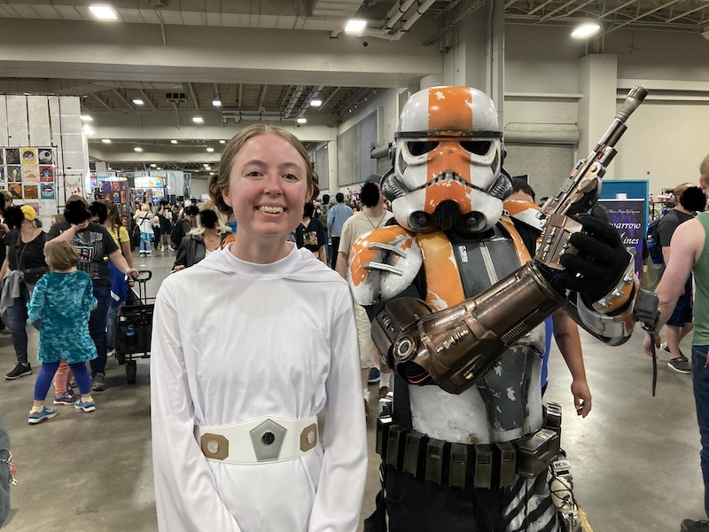

# Post #2

## Monday, September 25, 2023
Woohoo my second blog post!! 

This week I went to comic con in Salt Lake and it was so fun!!!! Everyone's costumes were so good and I loved seeing all the artwork and trinkets from various fandoms. I went with some of my cousins and we all dressed up as characters from Star Wars! I dressed up as Princess Leia. As we were wandering around the vicinity, we ran into a storm trooper, so of course I had to take a picture with him.

---

# My First Blog Post
## Monday, September 18, 2023
Took me a bit to find the right code to allow me to upload these MD files I am using to create my blog posts.

In the process of creating my own website, I encounter odd problems such as (1) not being able to see my react app hosted on a .github.io main profile page or (2) not finding a way to download the text out of several files in a folder... a current problem I have run into.

When I encounter problems like these I realize that there are multiple ways to solve these problems. I just have to try each of the ways I think will solve the problem until I run out of ideas, then come back to the problem later with a fresh mind.

It's wonderful to be able to see when all that problem solving has a reward, when it finally works!

So here is a blog post that was made possible from not giving up and to keep trying to understand and find a solution 🥳